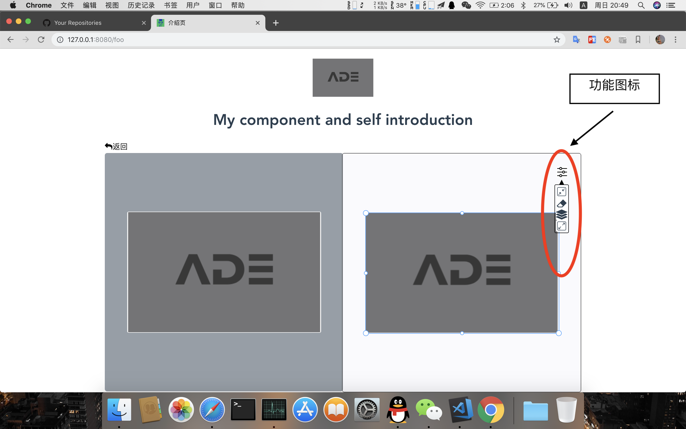

# vue-drag-screenshot
 
A Vue component to drag-screenshot
一个图片裁剪工具
 ## demo演示
 [demo](https://wei-zhe.github.io/)
 
 ## 安装
 
 ```JS
 npm install vue-drag-screenshot -S
 ```
 
 ## 使用
 
 ```js
 // ES6
 import vuedragscreenshot from 'vue-drag-screenshot'
 
 Vue.use(vuedragscreenshot)

 <vue-screenshot 
    v-model="parentValue"
    :width="500"
    :height="500"
    :imageSrc='imageSrc'
    :control  = 'control'
    >
</vue-screenshot>

control  : {
    narrow   : true,  // 缩小
    clears   : true,  // 清除
    restore  : true,  // 还原
    blowup   : true,  // 放大
}
 ```

## v-model
实时刷新的截图

```js
    // ES6
    
 ```

### Props
 
 |   name   |  Description  |   type   | default | type |
 | -------- | ------------- | :------: | :-----: | ---- |
 | width    | 截图区域宽        | Number	| 500 |（必传）
 | height   | 截图区域高        | Number	| 500 |（必传）
 | imageSrc | 传入需要裁剪的图片 | String	 |     | 选择参数，也可以不传
 | control  | 组建功能按钮      | Object	|     | 选择参数，也可以不传
 
 